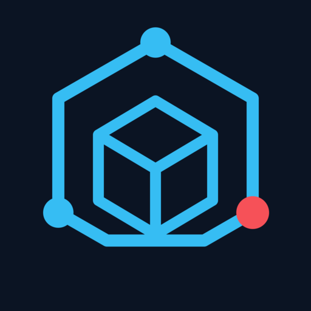

<p align="center">
  
</p>

<h1 align="center">Unity Debugger Pure MCP</h1>

<p align="center">
  <a href="https://marketplace.visualstudio.com/items?itemName=kpk.unity-debugger-pure-mcp"></a>
  <a href="https://open-vsx.org/extension/kpk/unity-debugger-pure-mcp"></a>
  <a href="https://pypi.org/project/unity-debugger-pure-mcp/"></a>
  <a href="https://github.com/kpkhxlgy0/unity-debugger-pure-mcp/actions/workflows/ci.yml"></a>
  <a href="LICENSE.txt"></a>
</p>

Unity Debugger Pure MCP is the independent local MCP companion for
[Unity Debugger Pure](https://marketplace.visualstudio.com/items?itemName=kpk.unity-debugger-pure)
`0.2.0` and its public debugger API v1. It supports Windows x64, VS Code 1.101
or newer, companion version `0.1.1`, and trusted workspaces. Install both VS
Code extensions and keep the matching VS Code window open: the companion
controls only debug sessions owned by that running extension host.

The companion declares `kpk.unity-debugger-pure` as an extension dependency.
It never imports the debugger repository's internal source and does not bundle
the Unity debugger Adapter or any Mono debugging assembly.

The client paths deliberately use the same Extension Host:

- VS Code Agent uses the native provider and bridge direct mode.
- Codex uses the pinned `uvx` launcher and bridge registry mode.
- Claude Code uses the same pinned launcher and bridge registry mode.

Starting a bridge for VS Code Agent does not block an external client. Clients connect
to the same companion Host and share its session state, reference generations,
breakpoint ownership, and serialized command queue. Prefer only one Agent to
issue control mutations at a time so human intent remains clear.

The companion provides 19 tools in these groups:

- target and session lifecycle: list, attach, status, and disconnect;
- source breakpoints and exception policy;
- snapshots, threads, stack frames, scopes, and variables;
- safe evaluation and separately authorized explicit evaluation; and
- pause, continue, step in/over/out, and normalized event waiting.

Safe evaluation uses the debugger's non-executing inspection context. Explicit
evaluation can execute target code and is accepted only when
`allowSideEffects` is the literal value `true`.

The companion sends no telemetry and opens no TCP listener. Its bundled MCP
executable connects to the matching VS Code extension host through a
capability-protected, current-user named pipe.

## VS Code Agent

Install Unity Debugger Pure `0.2.0` and this companion VSIX, then reload the VS
Code window once. The native MCP provider starts the packaged bridge in direct
mode; no MCP configuration or Python installation is required.

## Codex and Claude Code

External clients require [uv](https://docs.astral.sh/uv/) and the published
Windows launcher package. Installing the VSIX never writes external-client
configuration. From a trusted local project, explicitly run one of these
Command Palette commands:

- **Unity Debugger Pure MCP: Configure Codex**
- **Unity Debugger Pure MCP: Configure Claude Code**

Each command changes only its selected project's `.codex/config.toml` or
`.mcp.json`. Existing compatible entries must be explicitly adopted before the
extension can update or remove them. Conflicting or invalid entries are never
overwritten. Start a new client session after configuring; Claude Code still
shows and owns its normal project trust prompt.

For manual Codex setup, add this project-scoped configuration:

```toml
[mcp_servers.unity_debugger_pure]
command = "uvx"
args = [
  "--from",
  "unity-debugger-pure-mcp==0.1.0",
  "unity-debugger-pure-mcp"
]
startup_timeout_sec = 60
tool_timeout_sec = 70
enabled = true
required = false
```

For manual Claude Code setup, add this strict project-scoped `.mcp.json` entry:

```json
{
  "mcpServers": {
    "unity_debugger_pure": {
      "command": "uvx",
      "args": [
        "--from",
        "unity-debugger-pure-mcp==0.1.0",
        "unity-debugger-pure-mcp"
      ],
      "env": {}
    }
  }
}
```

No username, installation directory, environment shim, pipe name, or
capability token belongs in client configuration. The launcher uses the
client's current project directory to select one live, trusted VS Code window.
Start or reload that window before starting the external MCP client. If no
matching Host exists, tools fail closed with `BRIDGE_UNAVAILABLE`; after a VS
Code reload, the next call reconnects through the refreshed registration.

The earlier global-storage installer design is superseded by this versioned
launcher package. The extension does not copy launchers and never edits client
configuration unless the user invokes the matching project command and
confirms a permitted action.

## Local validation

Local Windows x64 builds support Node.js `>=26.5.0 <27.0.0` and uv
`>=0.12.0 <0.13.0`:

```console
npm ci
npm run typecheck
npm test
npm run package
npm run test:package
```

The package command creates and audits the companion VSIX, a
`py3-none-win_amd64` launcher wheel, and its source distribution. The VSIX
retains a 12-file allowlist and contains no Python launcher; the launcher
artifacts contain no Adapter, Mono runtime, Node bundle, live capability, or
machine-specific path. Each local VSIX records the Node version and SHA-256 of
its own SEA in `dist/runtime-inventory.json`; local packaging never rewrites
the tracked release inventory.

Public workflows remain pinned to Node.js `26.5.0` and uv `0.12.0`. The
companion release additionally requires the freshly generated SEA inventory
to match the reviewed root `runtime-inventory.json` before uploading an
artifact.

## Release channels

- VS Code Marketplace: manual upload under `kpk`; the initial `0.1.0` listing
  exists.
- Open VSX and companion GitHub Release: `companion-v<version>`.
- PyPI and launcher GitHub Release: `launcher-v<version>`.

The two automated release streams rebuild and audit only their own product.
GitHub Actions never uploads to the VS Code Marketplace.
